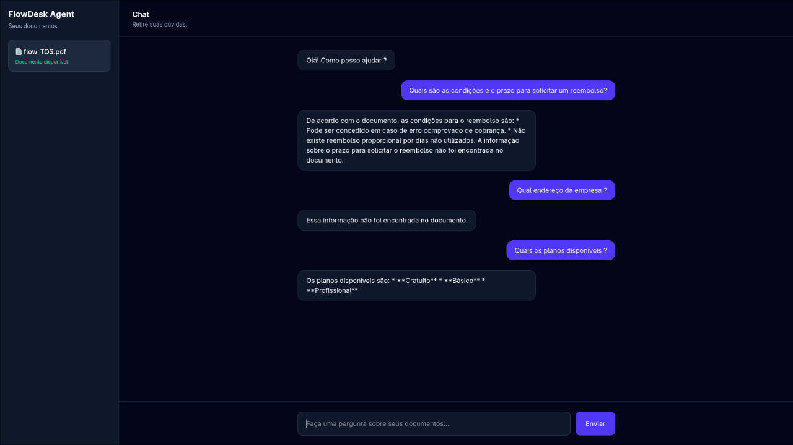

# 🤖 FlowDesk Agent — RAG com IA

Agente de Inteligência Artificial capaz de responder perguntas utilizando informações presentes em documentos PDF.

O projeto utiliza **RAG (Retrieval-Augmented Generation)** para buscar informações relevantes no documento e utilizá-las como contexto para gerar respostas claras e relacionadas à base de conhecimento.

> Projeto desenvolvido como atividade do programa **Oracle Next Education (ONE)**.

---

## 🌐 Aplicação Online

🚀 **O projeto está publicado e disponível para testes:**

### 👉 [Testar o FlowDesk Agent](https://flowdesk-agent.vercel.app/)

Não é necessário instalar ou configurar nada. Basta acessar a aplicação e enviar uma pergunta.

> **Observação:** o backend utiliza uma instância gratuita do Render. Após períodos sem utilização, o servidor pode entrar em suspensão. Por isso, a primeira resposta pode levar alguns segundos enquanto o serviço é inicializado.

---

## 📸 Funcionamento



O usuário envia uma pergunta através da interface de chat e o agente procura a informação correspondente na documentação da **FlowDesk**.

### Exemplo

**Pergunta:**

> Quais os planos disponíveis?

**Resposta:**

> Os planos disponíveis são: Gratuito, Básico e Profissional.

Caso uma informação não esteja presente no documento:

**Pergunta:**

> Qual o endereço da empresa?

**Resposta:**

> Essa informação não foi encontrada no documento.

Isso reduz respostas inventadas pelo modelo e mantém o agente baseado na fonte fornecida.

---

## 🧠 Como funciona o RAG

O fluxo da aplicação funciona da seguinte forma:

```text
PDF
 ↓
Extração do texto
 ↓
Divisão em trechos (chunks)
 ↓
Criação dos embeddings
 ↓
Indexação dos documentos
 ↓
Pergunta do usuário
 ↓
Busca semântica
 ↓
Recuperação dos trechos relevantes
 ↓
LLM recebe contexto + pergunta
 ↓
Resposta
```

Em vez de depender apenas do conhecimento do modelo de IA, o sistema recupera informações da documentação antes de gerar a resposta.

---

## 💬 Interações

Além das perguntas sobre os documentos, o agente consegue lidar com interações simples do cotidiano:

```text
Oi
Olá
Bom dia
Obrigado
Tchau
```

Perguntas relacionadas à documentação utilizam o fluxo RAG.

---

## 🛠️ Tecnologias

### Backend

* Python
* FastAPI
* Uvicorn
* PyMuPDF
* RAG
* Embeddings
* Gemini API

### Frontend

* React
* JavaScript
* Tailwind CSS
* Vite

### Cloud

* Vercel — Frontend
* Render — Backend

---

## 🏗️ Arquitetura

```text
Usuário
   ↓
React + Vercel
   ↓
FastAPI + Render
   ↓
RAG
   ├── PDF / Base de conhecimento
   └── Gemini API
   ↓
Resposta
```

A interface desenvolvida em React envia as perguntas para a API construída com FastAPI.

O backend executa o processo de recuperação das informações relevantes no documento e utiliza o Gemini para gerar a resposta com base no contexto encontrado.

---

## 🚀 Executando localmente

Clone o projeto:

```bash
git clone https://github.com/phdev-lttk/flowdesk-agent.git
cd flowdesk-agent
```

### Backend

Crie e ative um ambiente virtual:

```bash
python3 -m venv .venv
source .venv/bin/activate
```

Instale as dependências:

```bash
pip install -r requirements.txt
```

Configure sua chave no `.env`:

```env
GEMINI_API_KEY=sua_chave_aqui
```

Inicie a API:

```bash
uvicorn app.main:app --reload
```

O backend estará disponível em:

```text
http://127.0.0.1:8000
```

A documentação Swagger estará disponível em:

```text
http://127.0.0.1:8000/docs
```

### Frontend

Em outro terminal:

```bash
cd frontend
npm install
npm run dev
```

Acesse a URL exibida pelo Vite no terminal.

---

## 📡 API

O frontend envia as perguntas para:

```http
POST /ask
```

Exemplo:

```json
{
  "question": "Quais os planos disponíveis?"
}
```

Resposta:

```json
{
  "answer": "Os planos disponíveis são: Gratuito, Básico e Profissional."
}
```

---

## 🧪 Exemplos para testar

Perguntas que possuem resposta na documentação:

```text
Quais os planos disponíveis?

Qual plano possui acesso à API?

Quantos usuários posso ter no plano gratuito?

Como recuperar minha senha?

Qual o tamanho máximo de um arquivo?

Posso cancelar minha assinatura?
```

Também é possível testar perguntas cuja informação não existe:

```text
Qual o endereço da empresa?

A FlowDesk possui aplicativo para smartwatch?
```

Nesses casos, o agente deve informar que não encontrou a informação na documentação.

---

## ☁️ Deploy

A aplicação está dividida em dois serviços:

**Frontend:** Vercel
**Backend:** Render
**IA e Embeddings:** Gemini API

O fluxo em produção é:

```text
Usuário
   ↓
Vercel (React)
   ↓
Render (FastAPI)
   ↓
RAG + Gemini API
   ↓
Resposta
```

### 🔗 Acessar aplicação

👉 **https://flowdesk-agent.vercel.app/**

---

## 🎓 Projeto

Projeto desenvolvido para o programa **Oracle Next Education (ONE)** com o objetivo de aplicar conceitos de:

**Inteligência Artificial • RAG • Python • FastAPI • React • Processamento de documentos • APIs • Cloud**

---

⭐ Se este projeto foi útil ou interessante, considere deixar uma estrela no repositório.
